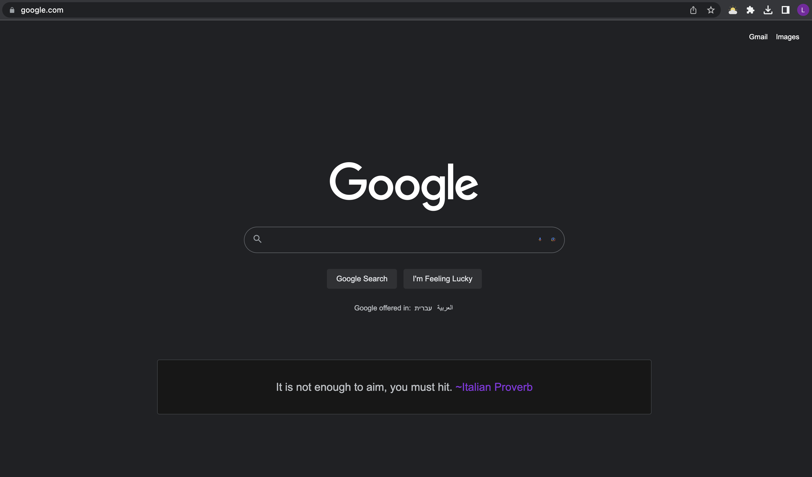

# Google Quote Extension

A small Chrome Extension App built from scratch where you get a random success motivation quote injected to google homepage.

## Screenshot

## Installation and Usage

1. Clone the repository to your local machine using the command
   `git clone https://github.com/liordesta/google-quote-extension.git`.
2. Go to the folder and install dependencing using `cd google-quote-extension.git && npm install or yarn install`.
3. Run `npm run build` to create the build `dist` folder.
4. On your browser go to `chrome://extensions/` and active `Developer mode`
5. Click on `Load unpacked` and navigate to the cloned folder.
6. Select dist and load it and that's it. you can check now `https://www.google.com`!
7. To work on it locally on dev env run `npm run watch` and follow step 6

## Technologies

List of technologies/tools used in the project:

- ReactJS
- Typescript
- Webpack
- Tailwind
